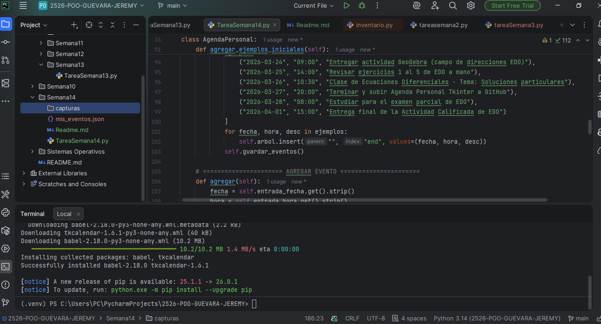
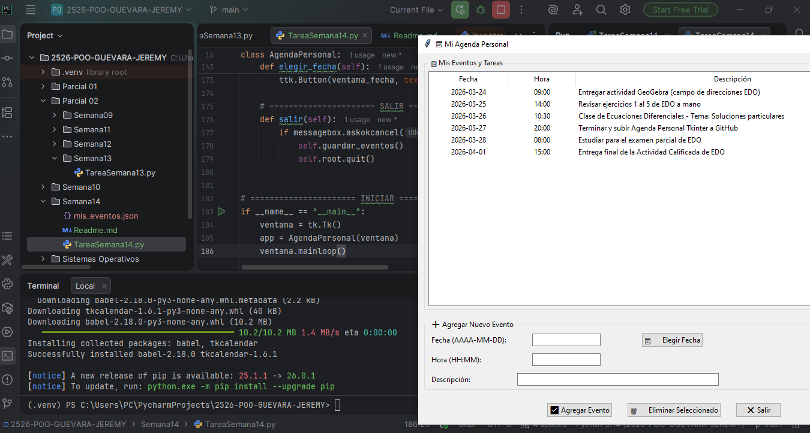
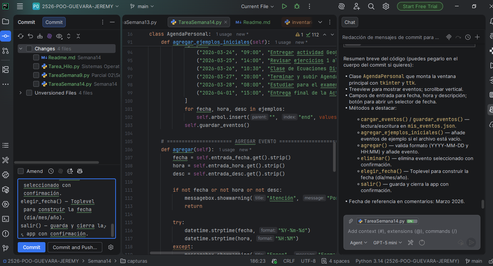
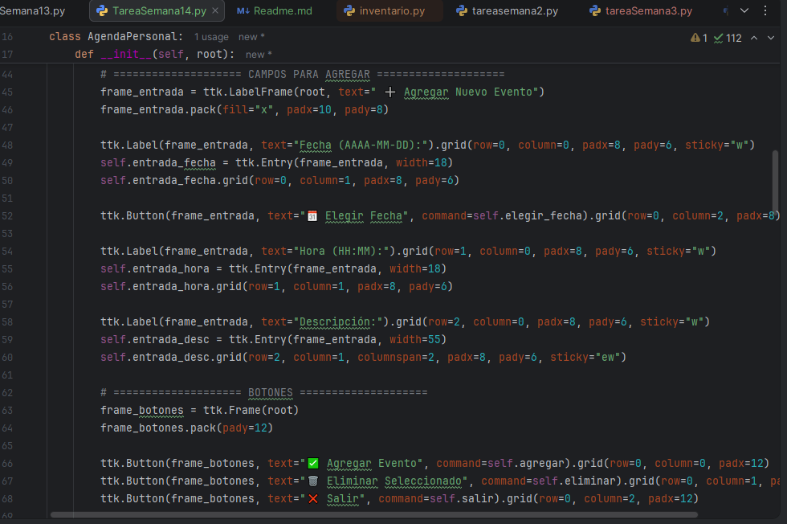
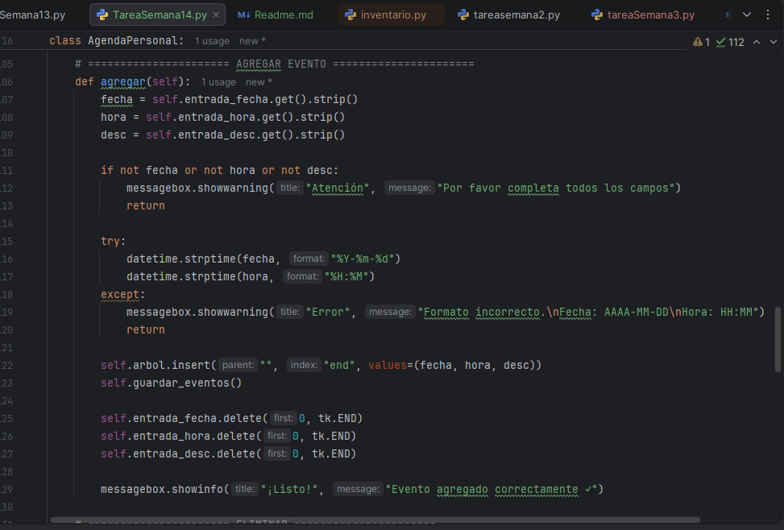

# Agenda Personal — TareaSemana14.py

Descripción
-----------
Pequeña aplicación de escritorio creada con Tkinter para gestionar una agenda personal (eventos y tareas). Permite agregar, eliminar y visualizar eventos con fecha, hora y descripción. Los datos se guardan en formato JSON en el archivo `mis_eventos.json` para persistencia entre ejecuciones.

Características principales
--------------------------
- Interfaz gráfica con Tkinter y ttk (Treeview) para mostrar los eventos.
- Añadir eventos con validación de formato para fecha (AAAA-MM-DD) y hora (HH:MM).
- Selector de fecha sencillo (ventana secundaria) para facilitar la entrada.
- Eliminar eventos con confirmación.
- Persistencia de datos en `mis_eventos.json` (UTF-8, legible).
- Ejemplos iniciales que se agregan automáticamente la primera vez que se abre la aplicación.

Requisitos
---------
- Python 3.8 o superior (probado con CPython en Windows).
- El módulo `tkinter` incluida en la biblioteca estándar de Python (instalada por defecto en la mayoría de las distribuciones).

Archivos relevantes
------------------
- `TareaSemana14.py` — código fuente de la aplicación (ubicado en esta carpeta).
- `mis_eventos.json` — archivo generado en tiempo de ejecución donde se almacenan los eventos.

Instalación y ejecución
-----------------------
1. Abre PowerShell en la carpeta raíz del proyecto o en la carpeta `Semana14`.
2. Ejecuta la aplicación con Python:

```powershell
python .\Semana14\TareaSemana14.py
```

Si estás ya dentro de la carpeta `Semana14`:

```powershell
python .\TareaSemana14.py
```

Uso
---
- Rellenar los campos Fecha (formato AAAA-MM-DD), Hora (HH:MM) y Descripción y pulsar "Agregar Evento".
- Usa el botón "Elegir Fecha" para seleccionar día/mes/año desde una ventana auxiliar.
- Selecciona un evento en la lista y pulsa "Eliminar Seleccionado" para borrarlo (se pedirá confirmación).
- Pulsa "Salir" para guardar los cambios y cerrar la aplicación.

Capturas
--------
La carpeta `capturas/` contiene 5 imágenes que muestran distintas pantallas de la aplicación. Se incluyen aquí para que queden referenciadas en el README y se vean en GitHub.

1. Captura 1 — Vista principal con lista de eventos: `capturas/evidencia1.png`
   

2. Captura 2 — Ventana para agregar evento (campos): `capturas/evidencia2.png`
   

3. Captura 3 — Selector de fecha (ventana secundaria): `capturas/evidencia3.png`
   

4. Captura 4 — Mensaje de confirmación al eliminar un evento: `capturas/evidencia4.png`
   

5. Captura 5 — Ejemplo de `mis_eventos.json` abierto en editor: `capturas/evidencia5.png`
   

Consejos para subir/visualizar las capturas en GitHub
---------------------------------------------------
- Asegúrate de añadir las imágenes al repositorio antes de hacer el push:

```powershell
git add .\Semana14\capturas\evidencia1.png \
	.\Semana14\capturas\evidencia2.png \
	.\Semana14\capturas\evidencia3.png \
	.\Semana14\capturas\evidencia4.png \
	.\Semana14\capturas\evidencia5.png
git add .\Semana14\Readme.md
git commit -m "docs(agenda): agregar capturas de pantalla y documentación";
git push
```

- GitHub mostrará las imágenes en el README si las rutas relativas son correctas (como `capturas/evidencia1.png`). Si no se visualizan, comprueba que los archivos estén realmente en la rama y ruta indicada.

Si quieres, puedo generar un único commit que incluya `TareaSemana14.py`, las capturas y el README con un mensaje sugerido.

Formato de `mis_eventos.json`
----------------------------
El archivo JSON guarda una lista de objetos con la siguiente estructura:

```json
[
	{
		"fecha": "2026-03-24",
		"hora": "09:00",
		"descripcion": "Entregar actividad GeoGebra"
	},
	{
		"fecha": "2026-03-25",
		"hora": "14:00",
		"descripcion": "Revisar ejercicios"
	}
]
```

Notas importantes
-----------------
- La aplicación valida que la fecha cumpla el formato `%Y-%m-%d` y la hora `%H:%M`. Si la validación falla, se mostrará un aviso.
- Si `mis_eventos.json` no existe o está vacío, la aplicación añade una serie de eventos de ejemplo la primera vez que se abre.
- `tkinter` suele venir instalado con Python en Windows; si recibes errores relacionados con `tkinter`, revisa la instalación de Python o instala una distribución que lo incluya.

Ideas de mejora (opcional)
-------------------------
- Añadir edición de eventos existentes.
- Mejorar la selección de fecha con un widget tipo calendario.
- Ordenar eventos por fecha/hora en el Treeview.
- Permitir exportar/importar en otros formatos (CSV, iCal).

Autor
-----
Jeremy — Universidad Estatal Amazónica — Marzo 2026

Licencia
--------
Proyecto para fines académicos; ajustar según necesidad (por ejemplo MIT / CC).


